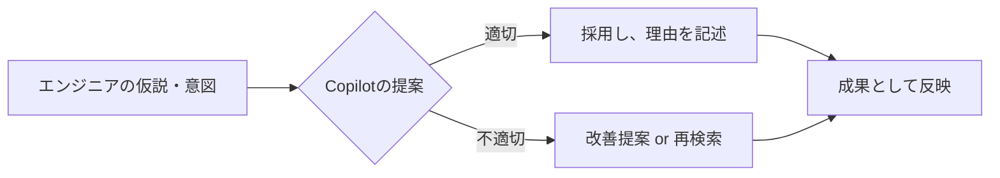

## 🚀 育成できる Copilot 運用マニュアル（ドラフト）

### 📘 はじめに

最初は「使ってみれば便利さがわかるはず」との思いから、Copilotの使用を強制しました。しかしその結果、**自分で考えずに提案を受け入れる傾向**が強まり、**技術者としての成長を阻む状況**が見られるようになりました。

この経験を踏まえ、今は単なる利用ではなく「**育成に繋がる活用法**」が求められています。

Copilotは優秀な補助ツールですが、正しく運用しなければ「思考停止の道具」となり、技術者としての成長を妨げるリスクがあります。\
本マニュアルでは、\*\*「自ら学び・考える力を保ちつつ、Copilotの恩恵を最大化する運用方法」\*\*を提示します。

---

### 🎯 運用目的（Why）

- Copilotの導入目的は「**生産性の向上**」と「**学習サポート**」
- しかし誤った使い方では「**依存・ミス多発・成長停止**」を引き起こす
- 本マニュアルは、**自立したエンジニア育成**を軸にしたCopilot運用を目的とする

---

### 🧭 Copilot三原則（再確認）

1. **候補は「仮説」：必ず自分で再確認せよ**
2. **出力には「理由」を説明できるようにすること**
3. **Copilotの提案以外の選択肢を一度は考えること**

---

### 🛠 使用ルール（Do）

| シーン           | 推奨される行動                              |
| ------------- | ------------------------------------ |
| コーディング時       | 候補のコードに対して「なぜそうなる？」と自問する             |
| エラー発生時        | Copilotのせいにせず、**自己検証＋公式ドキュメント確認**を優先 |
| Pull Request時 | 「Copilot生成か？」「他に候補あったか？」を説明に書く       |
| チーム内レビュー      | 「この選択にした理由」を必ずレビューコメントに残す            |

---

### ⛔ 禁止事項（Don't）

- 候補を **「よく分からないけど採用」**
- Copilotの出力を **無批判にコピー＆ペースト**
- 他人に「うまく動かない」とだけ言って **調査を放棄**
- Pull Requestに **「Copilotがやった」だけの説明**

---

### 🔍 教育・評価ポイント（メンター/リーダー向け）

| 項目        | チェック方法                         |
| --------- | ------------------------------ |
| 調査姿勢      | コードの根拠を聞いたときに即答できるか？           |
| Copilot理解 | 他の提案・選択肢を見たうえで採用理由を語れるか？       |
| 自主学習      | 提案コードに対し、公式情報やベストプラクティスと比較したか？ |
| エラー処理の対応力 | 「なぜエラーが出たか」を説明できたか？            |

---

### 💬 フィードバック例（指導テンプレ）

- 「このコード、どこがどう優れてると思った？」
- 「他にどう書けると思う？調べた？」
- 「この提案、他のプロジェクトでも使えるかな？」
- 「もしAIがいなかったら、どうやって書いたと思う？」

---

### 📚 ケーススタディ

#### ケース1：初学者がControllerを自動生成 → 不適切なロジック混入

- **状況**：CopilotにControllerを丸ごと書かせ、何も修正せずそのまま使用
- **問題点**：
  - バリデーションが不十分
  - サービス層が存在せずビジネスロジックがControllerに直書き
- **対処**：
  - 「層の責務を説明できるか？」を確認
  - 過去のベストプラクティスと比較しながらレビュー

#### ケース2：Copilotが提案したSQLがN+1を誘発

- **状況**：`foreach`内でクエリを発行するコードが提案され、それを採用
- **問題点**：パフォーマンス劣化（N+1問題）
- **対処**：
  - 「そのSQL、何件実行されると思う？」と問いかけ
  - `.Include()`やJOINベースの提案を自力で出せるよう指導

---

### 🖼 図解：Copilotとエンジニアの関係性

この図は、Copilotがあくまで\*\*「補助脳」\*\*であり、意思決定と責任はエンジニアにあることを示しています。

---

### 🧪 CopilotのRAG的活用法

CopilotはRAG（Retrieval-Augmented Generation）的に活用することで、単なるコード生成AIを超えた知的支援ツールとなります。実際の取り組みでは、以下のような素材を投入することで新たな価値が生まれています：

- 設計資料（XLS形式）
- ソースコード一式
- 環境別の設定ファイル（appsettingsなど）

これにより、システム全体を**さまざまな角度から立体的に把握できるようになり、大きな助けとなっています**。従来の静的な文書では見えなかった、構成間のつながりや依存関係、環境別の挙動差分が、Copilotの提案を通じて浮かび上がってきます。

Copilotが提供する支援には以下のような特徴があります：

| 活用素材      | RAG的成果例                                   |
| --------- | ----------------------------------------- |
| 設計資料（XLS） | フィールド説明・項目相関の再構成、ドキュメント生成、ユースケース補完        |
| ソースコード    | サービス間の依存関係の可視化、メソッド間の流れ分析、設計意図の抽出         |
| 設定ファイル    | 環境別構成の比較、API連携や接続文字列の動的マッピング、自動化可能ポイントの抽出 |

このような活用により、Copilotは「静的資料を再編集するAI」ではなく「**文脈に応じて必要情報を組み合わせ、理解を深めるAI**」としての価値を発揮します。

ときには資料化せず、\*\*その場その時の課題に応じて“動的にナレッジを再構成する”\*\*ほうが、成果につながることもあるでしょう。

CopilotはRAG（Retrieval-Augmented Generation）的に活用することで、単なるコード生成AIを超えた知的支援ツールとなります。実際の取り組みでは、以下のような素材を投入することで新たな価値が生まれています：

- 設計資料（XLS形式）
- ソースコード一式
- 環境別の設定ファイル（appsettingsなど）

これらを元にCopilotが提供する支援には以下のような特徴があります：

| 活用素材      | RAG的成果例                                   |
| --------- | ----------------------------------------- |
| 設計資料（XLS） | フィールド説明・項目相関の再構成、ドキュメント生成、ユースケース補完        |
| ソースコード    | サービス間の依存関係の可視化、メソッド間の流れ分析、設計意図の抽出         |
| 設定ファイル    | 環境別構成の比較、API連携や接続文字列の動的マッピング、自動化可能ポイントの抽出 |

このような活用により、Copilotは「静的資料を再編集するAI」ではなく「**文脈に応じて必要情報を組み合わせ、理解を深めるAI**」としての価値を発揮します。

ときには資料化せず、\*\*その場その時の課題に応じて“動的にナレッジを再構成する”\*\*ほうが、成果につながることもあるでしょう。

---

### 🧠 最後に

Copilotは「**考える人の武器**」にはなりますが、考えない人には「**依存の鎖**」にもなり得ます。\
我々は、**AIと共進化する技術者を育てる**ために使うべきです。

